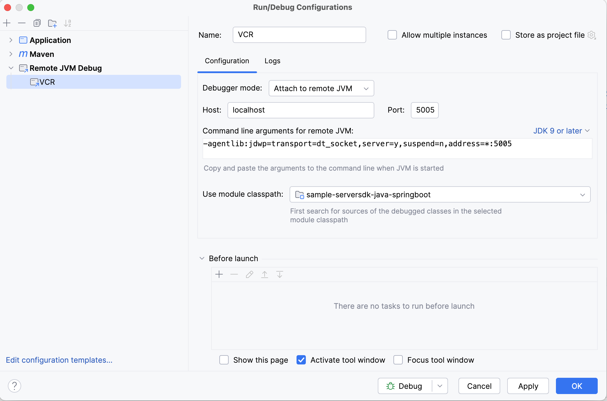

# Vonage Java Server SDK SpringBoot Demo App

This repo demonstrates usage of the [Vonage APIs](https://developer.vonage.com/en/api)
using the [Vonage Java Server SDK](https://github.com/Vonage/vonage-java-sdk). It is built
as a Spring Boot 3 web application.

The purpose of this is to provide an interactive demo for our APIs.
Unlike the [Java code snippets repo](https://github.com/Vonage/vonage-java-code-snippets),
you can see the snippets in action live without an IDE or local setup!

## Pre-requisites
You will need Java Development Kit 17 or later to run this demo.
Installation instructions can be found [here for Temurin JDKs](https://adoptium.net/en-GB/installation/) or
[here for Oracle JDK 21](https://docs.oracle.com/en/java/javase/21/install/overview-jdk-installation.html).

## Configuration
All the parameters required to run the demo can be provided through environment variables. These are as follows:

- `VONAGE_API_KEY`: Vonage account API key.
- `VONAGE_API_SECRET`: Vonage account API secret.
- `VONAGE_APPLICATION_ID`: Vonage application UUID.
- `VONAGE_PRIVATE_KEY_PATH`: Absolute path to the private key associated with your Vonage application.
- `VCR_PORT`: Port to run the demo on. By default, this is `8080`.
- `VONAGE_SERVER_URL`: The public base URL for the application. For example, this might be your ngrok instance URL.

Other parameters can be provided for convenience or defaults for pre-populating certain fields. These are:

- `TO_NUMBER` - default recipient phone number
- `VONAGE_FROM_NUMBER` - a phone number assigned to your Vonage application
- `TO_EMAIL` - default recipient e-mail address
- `VONAGE_FROM_EMAIL` - a sender e-mail address assigned to your Vonage account / application
- `VONAGE_WHATSAPP_NUMBER` - used as the sandbox `from` value for WhatsApp
- `VONAGE_VIBER_ID` - used as the sandbox `from` value for Viber
- `VONAGE_MESSENGER_ID` - used as the sandbox `from` value for Facebook Messenger

## Build & Run
If you have [IntelliJ IDEA](https://www.jetbrains.com/idea/) installed, you can import this project
and run it through the IDE, where the entry point is the `Application` class
(src/main/java/com/vonage/sample/serversdk/springboot/Application.java).

To run the demo standalone from the command line, simply invoke `mvn` or `./mvnw` if you don't have it installed.
Then open a browser to [localhost:8080](http://localhost:8080) to use the application.

The default Maven goal for this project is `spring-boot:run`. To ensure a full build, you can use `mvn clean install`.
This will also build a fat JAR file so that the application can be run anywhere by generating an executable file
with the '-jar-with-dependencies.jar' suffix  in the `target` directory. It will also make this application and
its dependencies available in your local Maven repository if you wish to use it as a dependency in another project.

On startup, your Vonage application will be updated with the webhook URLs for the demo.
This is so that you don't have to manually set the webhook URLs on the dashboard every time you restart
ngrok (or your preferred HTTP tunneling service). You can verify this manually by checking the application
from [the Vonage dashboard](https://dashboard.nexmo.com/applications).

### Maven and Gradle
As a demo application, this project uses Maven, however it can be adapted to work with Gradle too.
You can use the Maven wrapper by invoking `./mvnw`. For a local installation, you can download this
from [here](https://maven.apache.org/download.cgi) and add it to your PATH, or install via your OS's
package manager.

For convenience and illustrative purposes, the necessary files for Gradle are provided. It is recommended
to use the Gradle wrapper (see the [gradle](gradle) directory), which can be invoked via the `./gradlew`
command. A sample [build.gradle](build_example.gradle) file, which just invokes the `pom.xml` is provided.
An auto-generated Gradle (Kotlin DSL) configuration is provided for your convenience. To avoid conflicts in
VS Code, Gradle auto-import is disabled in [the settings](.vscode/settings.json).

## VCR Deployment
This demo is designed to be deployed to [Vonage Cloud Runtime](https://developer.vonage.com/en/vcr/overview).
You need to [install the Cloud Runtime CLI](https://github.com/Vonage/cloud-runtime-cli?tab=readme-ov-file#installation),
and [configure it](https://github.com/Vonage/cloud-runtime-cli/blob/main/docs/vcr.md).

Make sure the project is built using `mvn clean install`. Then run `vcr deploy --app-id $VONAGE_APPLICATION_ID`.
The manifest for VCR deployment is defined in [vcr.yml](vcr.yml).

## VCR Debugging
The application can also be debugged with an IDE even while running on VCR, using a remote debugger.
Run `vcr debug --app-id $VONAGE_APPLICATION_ID`. The JVM will suspend until you attach a debugger to it.

Instructions for setting up remote debugging will vary depending on your IDE, but for IntelliJ, you
can use the following configuration:

To debug interactively through Cloud Runtime / CodeHub with the integrated Visual Studio Code editor,
you can use the [Debug Configuration](.vscode/debug.json) provided in this project. For instructions
on how to use the debugger, see [the official documentation](https://code.visualstudio.com/docs/java/java-debugging).

